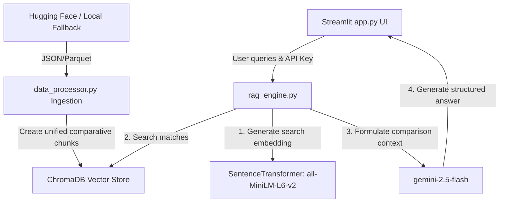

# RAG Indian Criminal Law transition Navigator ⚖️

An interactive Retrieval-Augmented Generation (RAG) legal chatbot and translator designed to help legal practitioners, students, and citizens study the differences between legacy Indian criminal codes and the new criminal laws.

The application maps:
- **Indian Penal Code (IPC), 1860** ➔ **Bharatiya Nyaya Sanhita (BNS), 2023** (Substantive Criminal Law)
- **Code of Criminal Procedure (CrPC), 1973** ➔ **Bharatiya Nagarik Suraksha Sanhita (BNSS), 2023** (Procedural Criminal Law)
- **Indian Evidence Act (IEA), 1872** ➔ **Bharatiya Sakshya Adhiniyam (BSA), 2023** (Law of Evidence)

## Architecture Overview



## Features

1. **💬 Comparative Chatbot (RAG):** Ask natural language questions (e.g., *"What is the difference between IPC 302 and BNS 103?"*, *"How does police custody change under BNSS?"*). The system retrieves matching statutory transitions and uses Gemini to explain reforms with direct citations.
2. **🔍 Side-by-Side Section Translator:** Directly lookup any section number (e.g., `302`, `438`, `65B`) under any category and see original and reformed sections side-by-side.
3. **📊 Law Reform Dashboard:** Tabulated summaries of core procedural, substantive, and evidence changes (like Zero FIRs, e-evidence, virtual trials, and timelines).

## Setup & Running Guide

### 1. Prerequisites
Ensure you have Python 3.9 or higher installed on your computer.

### 2. Clone/Prepare Workspace
Navigate to the directory:
```bash
cd c:\SamStuff\RAG-Indian-Laws
```

### 3. Install Dependencies
Run the installation command in your terminal shell:
```bash
pip install -r requirements.txt
```

### 4. Configure Google Gemini API Key
To query the LLM and generate embeddings, you need a Google Gemini API Key.
You can get a free/pay-as-you-go API key from the [Google AI Studio](https://aistudio.google.com/).

You have two options to configure it:
- **Option A (Recommended):** Set it as an environment variable in your terminal before running:
  - **Windows (Command Prompt):** `set GEMINI_API_KEY=your_api_key_here`
  - **Windows (PowerShell):** `$env:GEMINI_API_KEY="your_api_key_here"`
  - **Linux / macOS:** `export GEMINI_API_KEY="your_api_key_here"`
- **Option B:** Paste the key directly in the input box in the Streamlit Sidebar.

### 5. Launch the Web Interface
Start the Streamlit application:
```bash
streamlit run app.py
```
This will launch your web browser and open the application (typically at `http://localhost:8501`).

### 6. Index the Database
Once the app loads:
1. Ensure your API Key status in the sidebar is green ("✓ API Key loaded").
2. Click the **"📥 Ingest & Build Index"** button in the sidebar. 
3. This downloads the IPC-BNS mapping from Hugging Face, structures CrPC-BNSS and IEA-BSA datasets, generates embeddings using `models/text-embedding-004`, and indexes them in a local ChromaDB collection (`/database`).
4. Once completed, the status will show ready, and all chatbot/translation features will be fully active!
