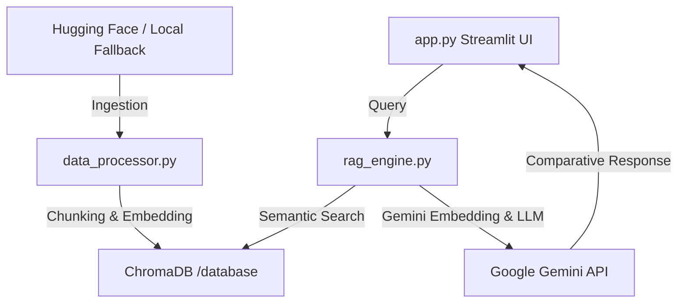

# Walkthrough - RAG Indian Legal Chatbot

I have successfully created the structure and logic files for the RAG Indian Criminal Law transition chatbot.

Here is a summary of the files created:
1. [requirements.txt](file:///c:/SamStuff/RAG-Indian-Laws/requirements.txt): Declares Python package dependencies.
2. [data_processor.py](file:///c:/SamStuff/RAG-Indian-Laws/data_processor.py): Automatically pulls the detailed IPC-BNS mapping from Hugging Face (falling back to a local robust database if offline) and compiles procedural/evidence reform data into unified chunks. It indexes these into ChromaDB.
3. [rag_engine.py](file:///c:/SamStuff/RAG-Indian-Laws/rag_engine.py): Implements semantic vector queries, direct metadata-based section lookup, and interfaces with the Gemini LLM for comparative responses.
4. [app.py](file:///c:/SamStuff/RAG-Indian-Laws/app.py): Renders the Streamlit frontend. It uses a modern dark-mode-first aesthetic with custom CSS styling, offering a sidebar for setup, a Chatbot tab (RAG), a Section Translator tab, and a Dashboard of legal reforms.
5. [README.md](file:///c:/SamStuff/RAG-Indian-Laws/README.md): Detailed installation and setup guide.

---

## Codebase Architecture

The project implements a classic modular RAG architecture:



---

## Verification Guide

To test the application on your machine, follow these verification steps:

### Step 1: Install Dependencies
Open your shell (Command Prompt, PowerShell, or Bash) and run:
```bash
pip install -r requirements.txt
```

### Step 2: Set API Key (Optional but recommended)
Set your Google Gemini API Key as an environment variable, or paste it directly into the sidebar text box inside the application:
```powershell
# PowerShell (Windows)
$env:GEMINI_API_KEY="your-api-key"

# Command Prompt (Windows)
set GEMINI_API_KEY=your-api-key
```

### Step 3: Run the Streamlit Application
Execute the following command to start the web server:
```bash
streamlit run app.py
```
This will open the interface in your browser at `http://localhost:8501`.

### Step 4: Index the Laws
Once the app is open:
1. Verify that the **API Key status** in the sidebar is green ("✓ API Key loaded").
2. Click **📥 Ingest & Build Index** in the sidebar. This will build the local ChromaDB database (showing progress logs in real-time).
3. Verify that the database status updates to "✓ Database Ready".

### Step 5: Test Features
- **Section Translator:** Select "IPC to BNS", input `302`, and click **Translate & Compare**. You should see a side-by-side comparison box for Murder (IPC 302 vs BNS 103).
- **RAG Chatbot:** Ask "What changes are introduced for police custody in BNSS?" or "How is sedition replaced under BNS?". The assistant will answer using the indexed database files and provide retrieved source cards inside an expander.
